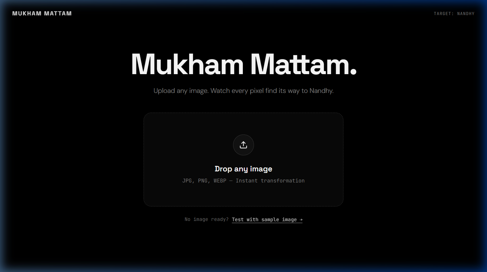
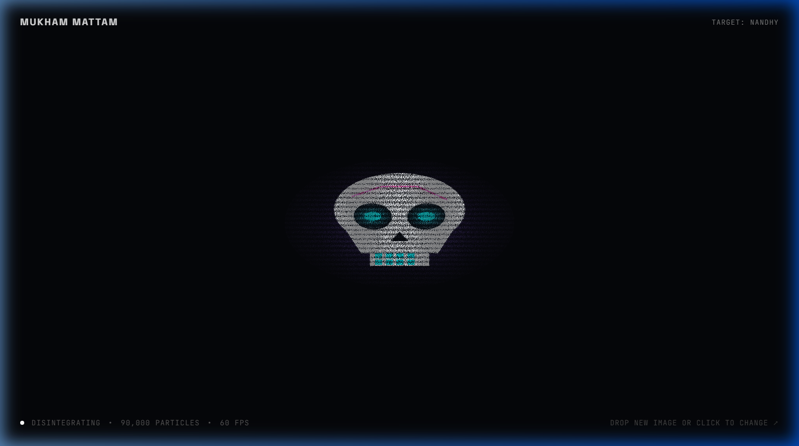
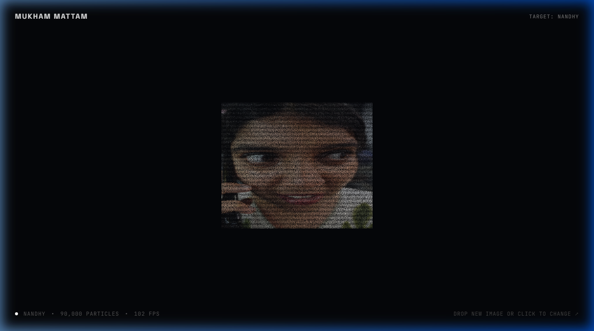
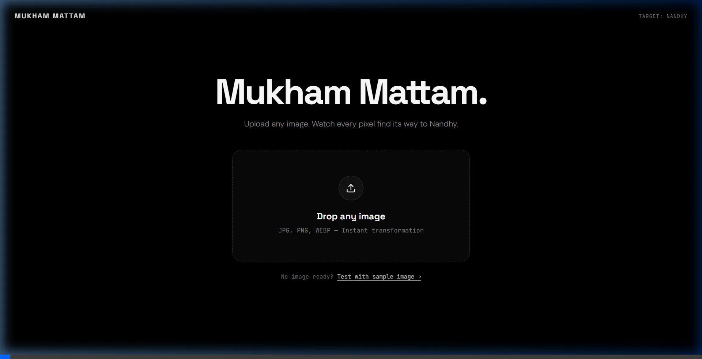

# Mukham Mattam 🎯


## Basic Details
### Team Name: Mukham Mattam


### Team Members
- Team Lead: Mevin Aby Manu

### Project Description
Mukham Mattam (Face Change) is an interactive, GPU-accelerated web experience where any uploaded image disintegrates into thousands of luminous particles and serenely reorganizes itself into an intimate portrait of Nandhy (`nandhy.jpeg`). Powered by custom WebGL shaders and fluid particle dynamics.

### The Problem (that doesn't exist)
The internet is flooded with billions of digital images—portraits, selfies, corporate headshots, and memes—yet tragically few of them are Nandhy. Humans are forced to manually search for photos online instead of having their existing photos automatically transform into Nandhy.

### The Solution (that nobody asked for)
Mukham Mattam deconstructs any uploaded image into 90,000 microscopic pointillist pixels using parallel GPU vertex shaders, guides them through gentle laminar physics and Ken Perlin's C2 smootherstep easing, and seamlessly constructs an intimate, relaxing portrait of Nandhy. Zero buttons, zero downloads, zero configuration—just inevitable, serene Nandhy.

## Technical Details
### Technologies/Components Used
For Software:
- Languages used: TypeScript, GLSL (OpenGL Shading Language), HTML5, CSS3
- Frameworks used: React 19, Vite
- Libraries used: Lucide React
- Tools used: Visual Studio Code, Git, GitHub

For Hardware:
- Display / Device with WebGL-capable GPU hardware acceleration

### Implementation
For Software:
# Installation
```bash
git clone https://github.com/MEV1N/mukham-mattam.git
cd mukham-mattam
npm install
```

# Run
```bash
npm run dev
```

### Project Documentation
For Software:

# Screenshots (Add at least 3)

*Minimalist Black & White Landing Page with drag-and-drop upload zone*


*Thousands of particles dissolving and flowing smoothly mid-flight using laminar GPU physics*


*90,000 particles at 144 FPS gracefully crystalized into the intimate Nandhy portrait*

# Diagrams
```
[User Uploads Any Image (JPG/PNG/WEBP)]
                   │
                   ▼
     [Offscreen Canvas Sampler]
   (Filters Alpha & Generates Grid)
                   │
                   ▼
   [Harmonic Spatial & Luminance Matcher]
     (Binned Morton Sorting to Nandhy)
                   │
                   ▼
    [GPU WebGL 1.0/2.0 Vertex Buffer]
(90,000 Particles Parallel Trajectory Math)
                   │
                   ▼
  [C2 Smootherstep Easing & Parabolic Drift]
 (Whisper-Soft Laminar Flow, No Quirky Jitter)
                   │
                   ▼
      [Final Crystallized Nandhy]
   (Interactive Soft Touch/Cursor Waves)
```
*Architecture and Data Flow Pipeline of Mukham Mattam's GPU particle engine*

For Hardware:

# Schematic & Circuit
*N/A — Pure software WebGL web application.*

# Build Photos
*N/A — Software-only particle installation.*

### Project Demo
# Video


[Watch Demo Video (record.mp4)](record.mp4)

> **Direct Link:** [View record.mp4 on GitHub](https://github.com/MEV1N/mukham-mattam/blob/main/record.mp4)

*Demonstrates the instant drag-and-drop transformation of images into the Nandhy portrait with smooth laminar particle dynamics and C2-continuous smootherstep easing.*

# Additional Demos
- Local development preview: `http://localhost:5173/`

## Team Contributions
- Mevin Aby Manu: Full-stack architecture, WebGL particle simulation engine, GLSL vertex & fragment shaders, spatial pixel matching algorithms, UI/UX minimal design, and project deployment.

---
Made with ❤️ at TinkerHub Useless Projects 


